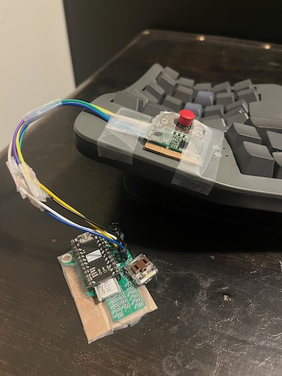

# Trckpnt - A trackpoint only ZMK device

There's a certain allure to the IBM TrackPoint that transcends mere
functionality. The subtle nub nestled amidst the keys, offering precision
and control with a mere flick of the finger, embodies efficiency and comfort
in its purest form.

  

  
  
  

# Build

Trckpnt is to be considered a proof of concept build at this stage.

It is based on the great work of [infused-kim][infused-kim] in
[zmk pr #1751][pr1751]. Once TrackPoint support is officially part of ZMK
I might work on this more and build a proper PCB and housing for the
controller.

As for now, this is good enough. It was a fun project to allow me to use
a TrackPoint again for mouse input which allows me to avoid having to move
my arm between the keyboard and a mouse for better ergonomics.

# Hardware

Trckpnt is built using a TrackPoint harvested from an old ThinkPad T400.
ZMK runs on the nRF52840 which is a wireless Bluetooth LE controller with
a Pro Micro/Elite-C compatible pinout.

The controller is powered by a single 110mAh battery. It also has a single
Kailh Choc switch attached which can be used to switch between BLE devices,
clear BLE connections or kick the controller into bootloader mode. This all
is achieved by utilizing [ZMK Tap-Dance behaviour][td].

1 tap - BLE device 0  
2 taps - BLE device 1  
3 taps - Clear current BLE profile  
4 taps - Bootloader

# Credits

Without the amazing work of [infused-kim][infused-kim] in [zmk pr #1751][pr1751] and all the hard work of all the contributors
who make ZMK what it is, trckpnt wouldn't be possible.

[td]: https://zmk.dev/docs/behaviors/tap-dance
[infused-kim]: https://github.com/infused-kim
[pr1751]: https://github.com/zmkfirmware/zmk/pull/1751
